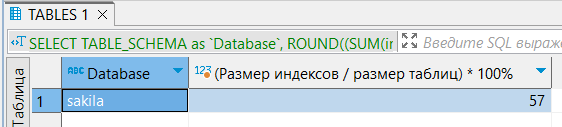

# Домашнее задание к занятию 12.5. «Индексы» - Гумлевой Александр

### Задание 1

Напишите запрос к учебной базе данных, который вернёт процентное отношение общего размера всех индексов к общему размеру всех таблиц.

 

```sql
SELECT TABLE_SCHEMA as `Database`, ROUND((SUM(index_length) / SUM(data_length)) * 100, 0) as '(Размер индексов / размер таблиц) * 100%'
FROM information_schema.TABLES
WHERE TABLE_SCHEMA = 'sakila'
GROUP BY TABLE_SCHEMA;
```
### Задание 2

Выполните explain analyze следующего запроса:
```sql
select distinct concat(c.last_name, ' ', c.first_name), sum(p.amount) over (partition by c.customer_id, f.title)
from payment p, rental r, customer c, inventory i, film f
where date(p.payment_date) = '2005-07-30' and p.payment_date = r.rental_date and r.customer_id = c.customer_id and i.inventory_id = r.inventory_id
```
- Составное условие WHERE можно переписать как JOIN, таблицы film, rental и inventory на результат запроса не влияют - их можно убрать из запроса, date(p.payment_date) использовать накладно т.к. используется дорогое приведение типа, можно создать составной индекс для c.last_name и c.first_name, индекс для p.payment_date, индекс для p.amount.

Результат

```sql
select concat(c.last_name, ' ', c.first_name), sum(p.amount) over (partition by c.customer_id)
from customer c 
JOIN payment p on c.customer_id = p.customer_id
WHERE p.payment_date >= '2005-07-30'
   AND p.payment_date <  '2005-07-30' + INTERVAL 1 DAY;
```

### Задание 3*

Самостоятельно изучите, какие типы индексов используются в PostgreSQL. Перечислите те индексы, которые используются в PostgreSQL, а в MySQL — нет.

GiST, SP-GiST, BRIN. (GIN - аналог инвертированного индекса MySQL, B-TREE и Хэш используются в MySQL).